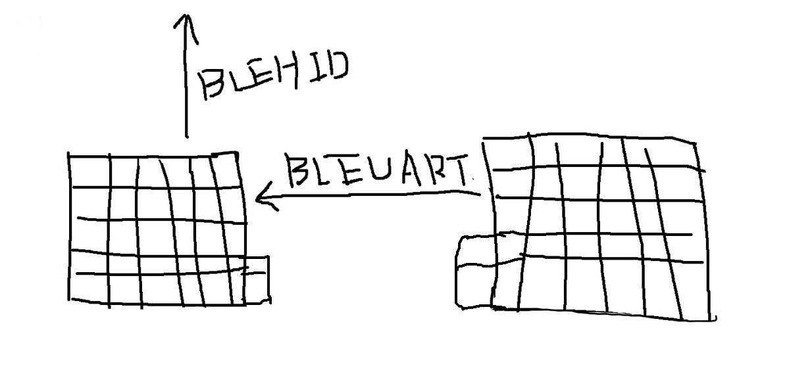

# Helix-Wireless

[Helix](https://github.com/MakotoKurauchi/helix)に[BL652-breakout](https://github.com/ogatatsu/BL652-breakout)
を載せてワイヤレスに改造した物。

## 仕組み
以下の図のようにマスター、スレーブ、PC間で通信する。

スイッチ１つ１つに一意なIDが振られていて、スレーブマスター間では押されたスイッチのIDを通信でやり取りする、
マスター側では受け取ったスレーブ側で押されたIDと自分側で押されたIDをキーマップからキーコードに変換してPCに送る。
キーマップはマスター側で持っているのでキー配列を変更する時はマスター側のプログラムを変更が必要となる。

## ビルド方法
- BL652-breakoutには予めFeather nRF52のブートローダーを書き込んでおく。

  参考URL
  
  https://learn.adafruit.com/bluefruit-nrf52-feather-learning-guide/flashing-the-bootloader
  https://qiita.com/ogatatsu@github/items/37f4888c885c4e287df1

- BL652-breakoutを右側、左側共にHelix PCBの白枠線内とは逆の方に刺す。(画像の赤い方)
  

- ArduinoをインストールしてボードマネージャーからFeather nRF52用の物をインストールしておく。

  参考URL

  https://learn.adafruit.com/bluefruit-nrf52-feather-learning-guide/arduino-bsp-setup

- ArduinoのライブラリマネージャからBounce2ライブラリをインストールする。
- Arduino IDEで.inoファイルを開いて右側のボードにはSlave用のファームウェア、左側にはMaster用のファームウェアを書き込む。

## キーカスタマイズ
